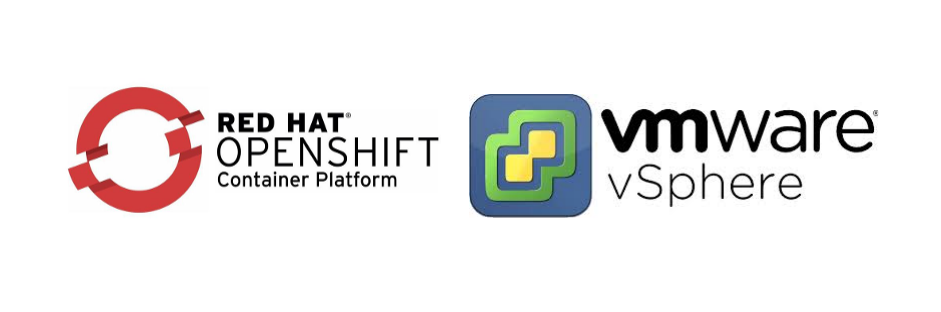
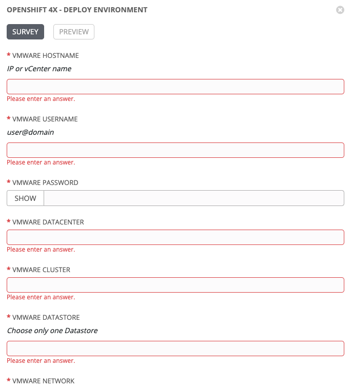

# **Deploy UPI OpenShift Container Platform installation over vSphere**

This project automates the deployment of Red Hat OpenShift Container Platform 4.x in UPI installations over VMware vSphere.

The playbooks are divided into 2 roles that must be executed individually.

**Pre requirements**
- CentOS 7.x or higher "bastion" machine.
- Communication between the bastion machine and the VMware environment.
- Balancer (HAproxy or similar) correctly configured.

**Manual actions**
- Between the 2 roles, it is necessary to cover the MACS of the VMs and reserve the IP in a DHCP so that the DNS and the IP coincide.

**Deploy-Environment**
- Setting up prerequisites in Bastion
- Creation of directory and configuration files
- Creation of access keys
- Client and Installer download
- Generation of manifest and ignition files
- Download RHCOS ova file
- Deployment OVA over vSphere
- Creation of OCP Virtual Machine Nodes

**Deploy-Cluster**
- Creation of the OCP cluster
- Create access variables
- Certificate approved
- Add storage to registry
- Verify the cluster

# Variables

If you use Ansible Tower, fill in the survey data, if you use ansible locally, check roles/deploy-xxxxxx/taks/vars/secret.yaml and set the variables with the necessary values.

